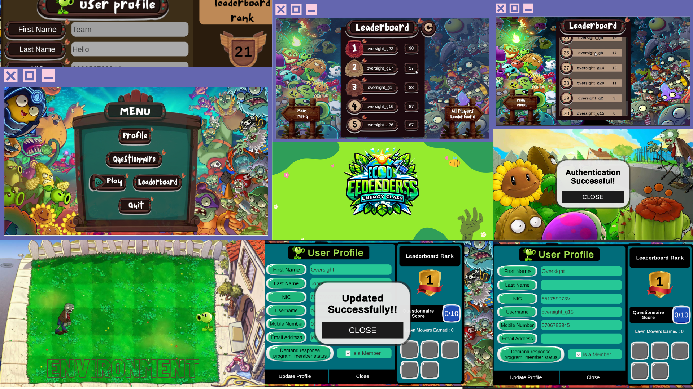

## ECO DEFENDERS - ENERGY CLASH

# Energy-Saving Game Project

## Overview
This project was developed as part of the EN3350 Software Design Competition at the University of Moratuwa. The primary goal is to create an interactive and educational game that motivates users to save energy by integrating it with a demand management application. The game fosters energy-saving behaviors such as reducing power consumption, adopting renewable energy sources, and participating in demand response programs.

## Features

### Player Authentication/Registration
- Utilizes an API key provided by instructors to authenticate players.
- A centralized HTTP request manager ensures the seamless integration of the JWT token in API calls.
- Authentication success leads to the main menu; otherwise, players are denied access.

### Player Profile
- Displays player profile details such as:
  - First Name
  - Last Name
  - NIC
  - Username
  - Mobile Number
  - Email Address
  - Demand Response Program Membership Status
- Missing information can be filled in and saved via an API.
- Ensures profile completion before proceeding to the game environment.

### Questionnaire
- A web-based MCQ questionnaire to assess player knowledge on electricity generation, transmission, and usage.
- Correct answers provide players with a boost (extra credits) to start the game.
- Players can view their scores and answers but cannot retake the questionnaire.

### Game Environment
- Reflects player energy-saving actions in real-time.
- Actions include:
  - Reducing consumption
  - Adopting renewable energy
  - Participating in demand response programs
- Visual feedback in the game environment (The available plants correlated to the credits you get from an energy-saving action have to be planted in the garden. You have to protect the house by attacking the zombies approaching, by simply clicking on the plants.)

### Leaderboard
- Dynamically ranks players based on their game performance.
- Criteria for ranking include energy-saving actions and other developer-defined scoring strategies.
- Randomized scores for other players maintain engagement.

## Tech Stack

### Questionnaire Web Application
- **Frontend**: React.js
- **Backend**: Java with Spring Framework
  - RESTful APIs for communication
  - Database management for storing questionnaire data

### Game Environment
- **Platform**: Unity with WebGL
  - Allows seamless gameplay in web browsers without additional plugins

### Development Guidelines
- Utilizes mock APIs for profile and energy-saving data.
- Follows software engineering best practices, including:
  - Object-Oriented Programming (OOP)
  - SOLID principles
  - Design patterns

## Setup and Deployment
TODO

To run the questionnaire: follow the instructions [here](Questionnaire.md)
.

### Prerequisites
1. Install [Unity](https://unity.com/) with WebGL support.
2. Install [Node.js](https://nodejs.org/) for running the questionnaire web application.
3. Ensure access to the provided mock API keys and documentation.

### Steps to Run
TODO

## Acknowledgments
This project was developed for the EN3350 Software Design Competition under the guidance of the Department of Electronic & Telecommunication Engineering and the Department of Biomedical Engineering, University of Moratuwa. Special thanks to the instructors for providing resources and support.
